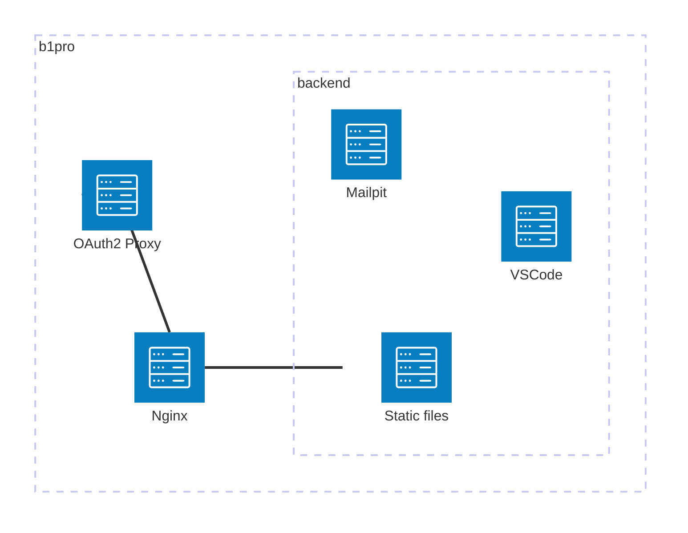

# b1pro

https://b1pro

```mermaid
architecture-beta
    group b1pro[b1pro]
    group backend[backend] in b1pro

    service nginx(server)[Nginx] in b1pro
    service oauth2(server)[OAuth2 Proxy] in b1pro
    service vscode(server)[VSCode] in backend
    service mailpit(server)[Mailpit] in backend
    service files(server)[Static files] in backend

    nginx:T -- L:oauth2
    nginx:R -- L:files{group}
```

