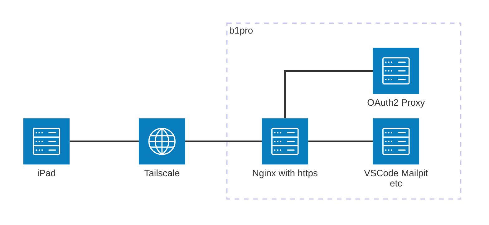

# b1pro

https://b1pro

```mermaid
architecture-beta
    group b1pro[b1pro]

    service client(server)[iPad]
    service internet(internet)[Tailscale]
    service nginx(server)[Nginx with https] in b1pro
    service oauth2(server)[OAuth2 Proxy] in b1pro
    service services(server)[VSCode Mailpit etc] in b1pro

    client:R -- L:internet
    internet:R -- L:nginx
    nginx:T -- L:oauth2
    nginx:R -- L:services
```
